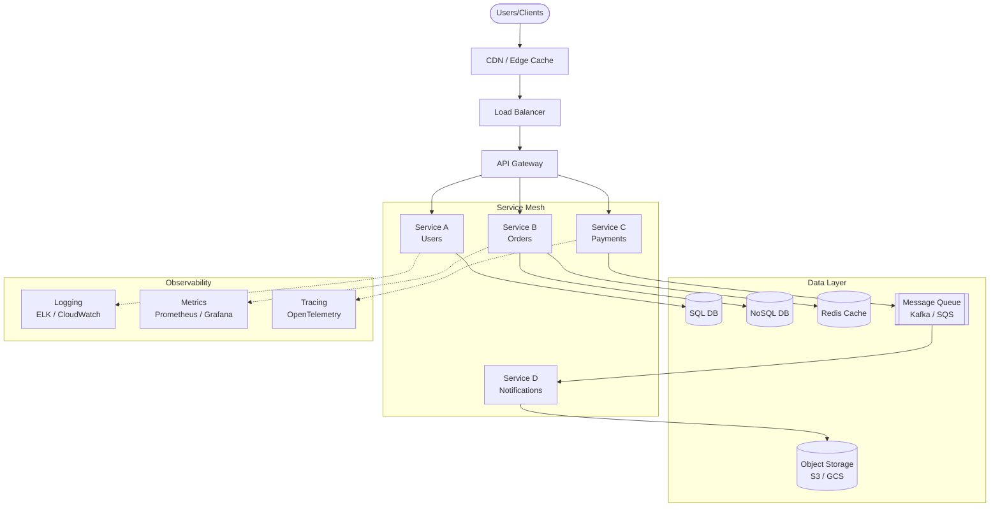
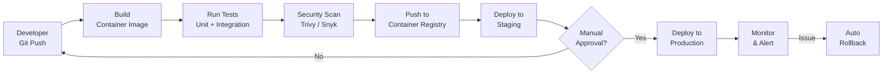
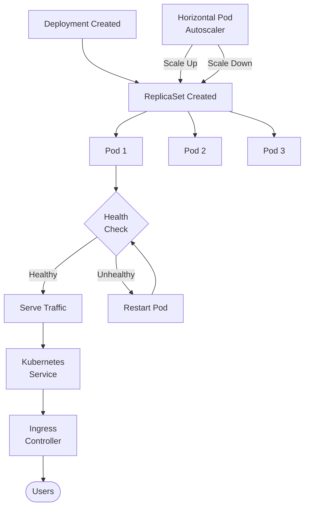
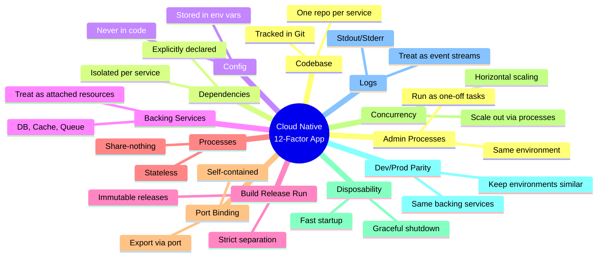
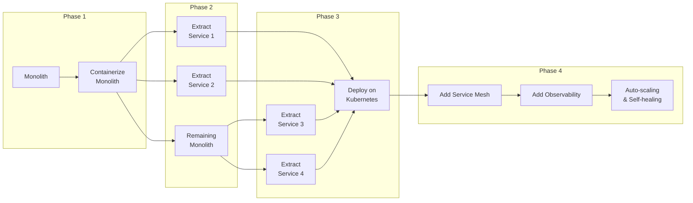
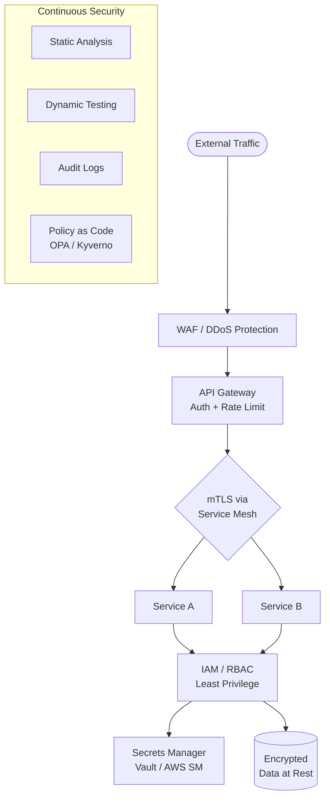

# Cloud-Native Architecture Guide

## 1. High-Level Cloud-Native Architecture

## 2. CI/CD Pipeline

## 3. Kubernetes Pod Lifecycle

## 4. The 12-Factor App Principles

## 5. Migration Path: Monolith to Cloud-Native

## 6. Cloud-Native Security (Zero Trust)

